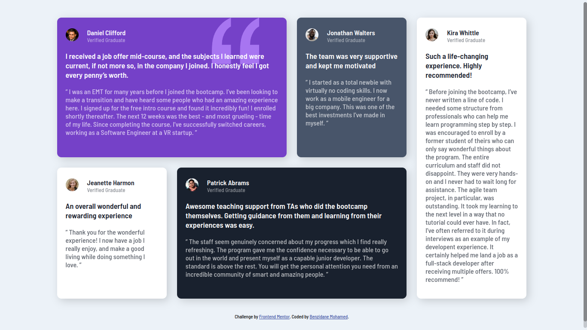

# Frontend Mentor - Testimonials grid section solution

This is a solution to the [Testimonials grid section challenge on Frontend Mentor](https://www.frontendmentor.io/challenges/testimonials-grid-section-Nnw6J7Un7). Frontend Mentor challenges help you improve your coding skills by building realistic projects. 

## Table of contents

- [Overview](#overview)
  - [Screenshot](#screenshot)
  - [Links](#links)
- [My process](#my-process)
  - [Built with](#built-with)
  - [What I learned](#what-i-learned)
- [Author](#author)

## Overview

### Screenshot

### Links

- Solution URL: [solution URL here](https://github.com/BenzidaneMo/testimonials-grid-section)
- Live Site URL: [live site URL here](https://benzidanemo.github.io/testimonials-grid-section/)

## My process

### Built with

- Semantic HTML5 markup
- CSS Grid

### What I learned

During the development of the testimonials grid challenge, I had the opportunity to explore and utilize CSS Grid to build a dynamic and responsive website. Throughout this process, I gained valuable insights and learned important lessons that enhanced my understanding of CSS Grid and media queries.

## Author

- Frontend Mentor - [@BenzidaneMo](https://www.frontendmentor.io/profile/BenzidaneMo)
- Twitter - [@Miracleinvoker_](https://twitter.com/Miracleinvoker_)